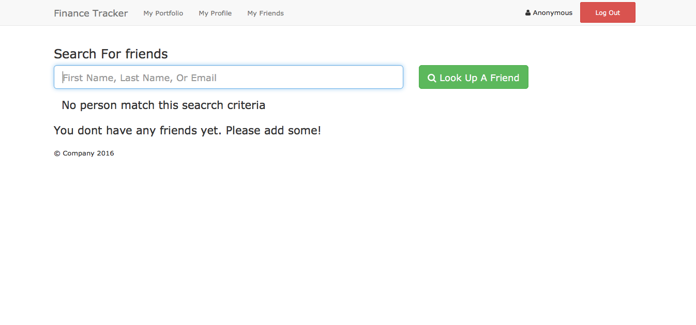

Finance Tracker
==
A Simple Stock Tracker For Registered Users. Allowing User To Look Up Stock Opening
And Closing Pricing. Along With Ability To Look Up Other Users And Add Them As Friends.

Features:

* Ruby version 2.3.0

* Devise(https://github.com/plataformatec/devise)

* Twitter-Bootstrap-Rails(https://github.com/seyhunak/twitter-bootstrap-rails)

* Stock Quote(https://github.com/tyrauber/stock_quote)

Database Creation & Initialization
==
* rake db:create
* rake db:migrate
* rake db:seed

Stock Search
==

Search And Add Friends
==

